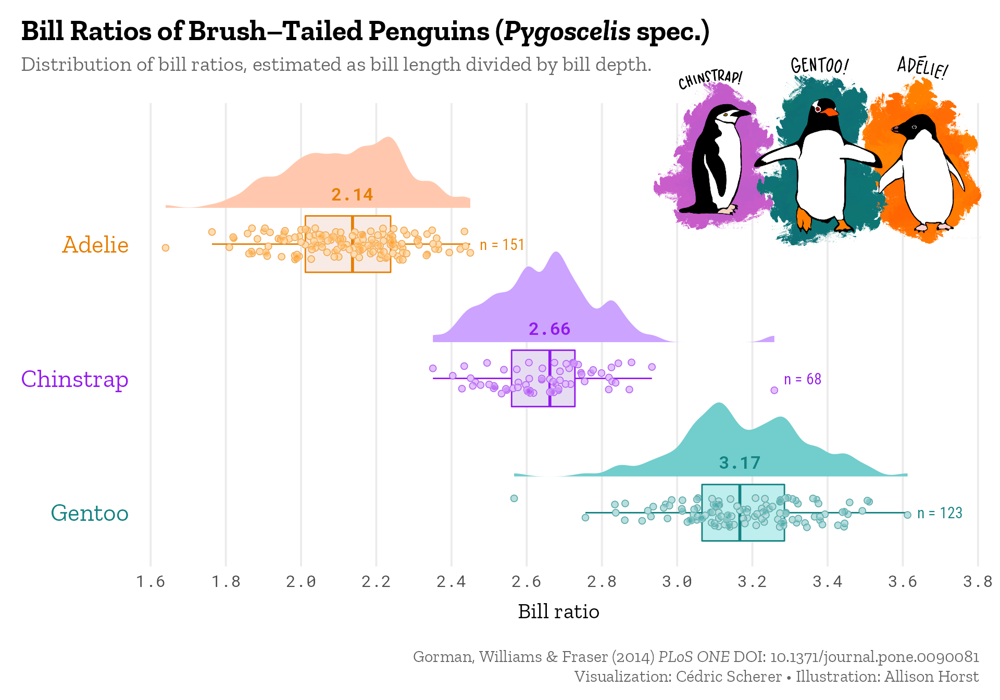
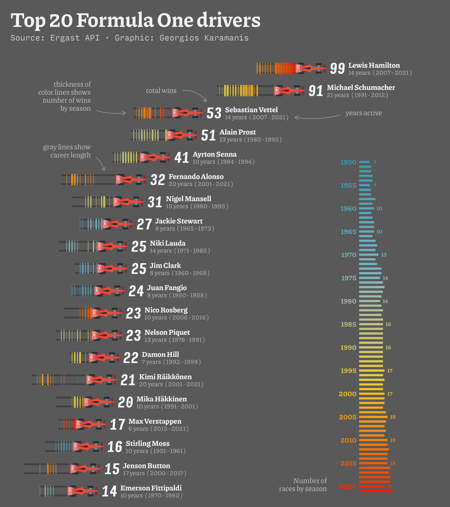
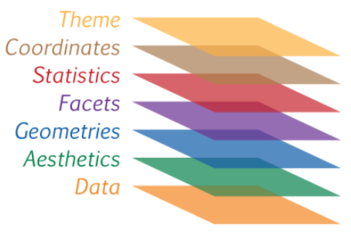
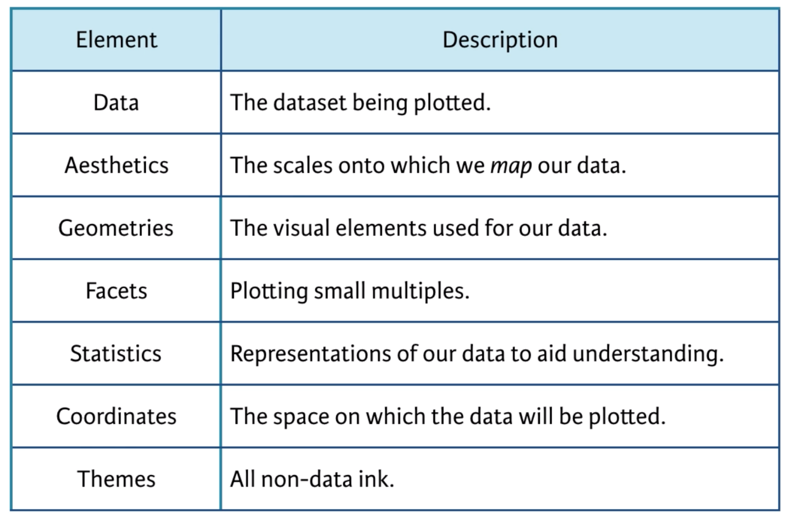
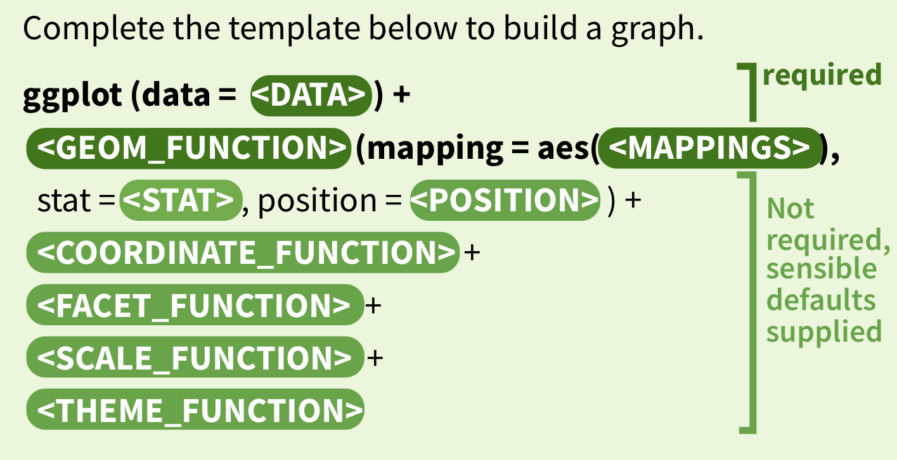
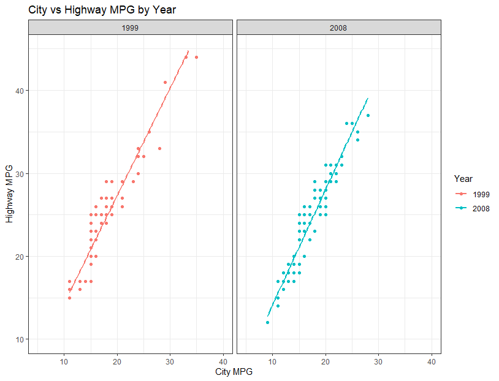
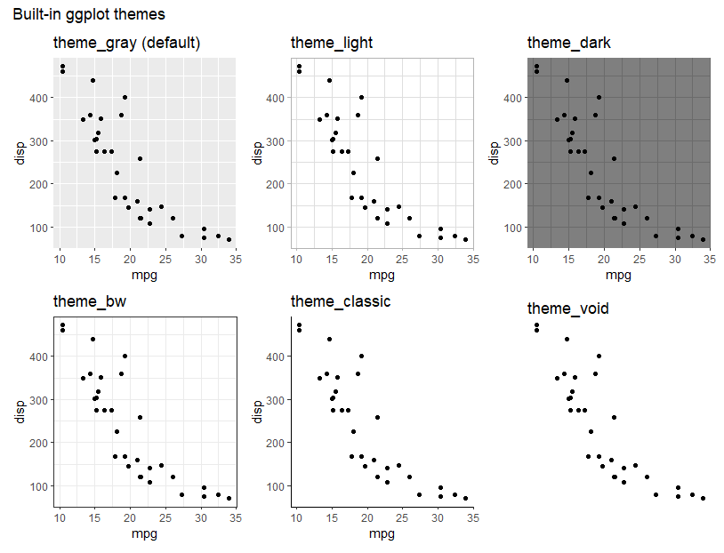

```{r setup, include=FALSE}
knitr::opts_chunk$set(echo = TRUE, fig.align = 'center')
knitr::knit_hooks$set(htmlcap = function(before, options, envir) {
  if(before) {
    paste('<p class="caption">', options$htmlcap, "</p>",sep="")
  }
})
```

## In this lesson

- What are a few ways to make quick plots in R?
- What is `ggplot2` and why is it useful?
- What are the “layers” involved in creating graphics?
- How can I customize my plots?
- How can I integrate additional packages to extend `ggplot2`?
- How do I save my final plots to files? 

## Why visualize?

- data is too large to digest by examining manually
- interactions in data easier to see visually
- want to confirm hypothesis that you have from tables and summaries
- it is fun!

#### The Datasaurus Dozen, by Justin Matejka and George Fitzmaurice
```{r, echo = FALSE, htmlcap = 'The Datasaurus Dozen, by Alberto Cairo'}
knitr::include_graphics('./img/datasaurus.gif')
```

## Plotspiration

#### Annotated plots, by Cédric Scherer

```{r, echo = FALSE, out.height='50%', out.width = '50%'}

```

#### Formula one racing, by Georgios Karamanis

```{r, echo = FALSE, out.height='50%', out.width = '50%'}

```

#### Generative Art, "Heartbleed" series by Danielle Navarro

```{r, echo = FALSE, out.height='50%', out.width = '50%'}
knitr::include_graphics('./img/navarro_heartbleed.png')
```

#### animated graphics with the `gganimate` package

```{r, echo = FALSE, out.height='50%', out.width = '50%'}
knitr::include_graphics('./img/gganimate_bubble.gif')
```

## Load some packages

```{r, warning = FALSE, message = FALSE}
library(tidyverse) # this includes ggplot2!
library(lubridate) # datetime stuff
library(visdat)    # for looking at column types and missing data
library(ggpubr)    # for overlaying a normal distribution curve
```


## Read in data (in case you removed it)

```{r}
## read in RDS file - this file type is specific to R and can hold just one R object
data_wide <- readRDS('./data/data_wide.rds')


## take a quick look at our data
head(data_wide)
glimpse(data_wide)
```

```{r}
## convert from wide to long format
data_long <- data_wide %>% 
  pivot_longer(cols = pH:Hg, names_to='Name', values_to='Value')

## take a quick look at our data
head(data_wide)
glimpse(data_long)
```

## Plotting in base R

A few straightforward types of plots are build in to base R. We can easily create scatterplots, boxplots, and histograms without much effort.

```{r}
x <- c(1,2,3,4,5,6,7,8)
y <- c(6,3,18,9,24,12,15,21)

plot(x, y, xlab = 'x-axis label', ylab = 'y-axis label', xlim = c(0,9), ylim = c(0, 25))
```

### Histograms

```{r, echo = TRUE}
## histogram of Organic Carbon
hist(x = data_wide$DOC, breaks = 10, 
     col = 'lightgreen', main = 'Histogram of Organic Carbon data')

```

### Boxplots

```{r}
boxplot(data_wide$DOC ~ data_wide$Site, 
        main = 'DOC at Reference vs Treated Sites')

boxplot(data_wide$DOC ~  data_wide$Treatment, 
        main = 'DOC by Time Period')

## add reference line for overall mean
abline(h = mean(data_wide$DOC, na.rm = TRUE), lty = 'dashed', lwd = 2, col = 'red')
```

For more on base R plotting, check out this page: 
 https://bookdown.org/rdpeng/exdata/the-base-plotting-system-1.html


## Visualizing missingness with the `visdat` package

```{r, echo = TRUE}
visdat::vis_dat(data_wide, sort_type = FALSE)
```

## What is `ggplot2`?

- a package in R
- a tool for systematically building, editing, and customizing graphics

It is based on a "grammar of graphics" that uses **layers** to describe the components of a figure, including the data and the "non-data" pieces.


```{r, echo = FALSE, fig.height = 6, fig.width = 7, fig.cap = 'https://englelab.gatech.edu/useRguide/introduction-to-ggplot2.html'}

```

```{r, echo = FALSE, fig.height = 6, fig.width = 7, fig.cap = 'https://englelab.gatech.edu/useRguide/introduction-to-ggplot2.html'}

```

`ggplot2` primarily builds plots using data frames, and it works well with other tidyverse packages. 

One major distinction is that instead of pipes (%>%), `ggplot2` commands are separated by '+' signs. Think of this as "adding" information to the plot. The ordering of commands is also flexible, so we will look at this example to come up with some suggestions.

```{r, echo=FALSE}

```

## An example plot

```{r, echo=FALSE, fig.height = 8, fig.width = 8}
knitr::include_graphics('./img/mpg_colored_code.png')
```

```{r, echo = FALSE, fig.height = 6, fig.width = 8}

```

## Aesthetics with `aes()` 

In `ggplot2`, aesthetics are the way we map **columns** of our data to different **visual attributes** of our plots. 

We can use the levels, values, and relationships in our data to control

- variables on *x* and *y* axes
- text labels
- color
- fill
- shape
- size
- many more!

When we put things inside the `aes()` function, they automatically take on values from the data, rather than us manually setting them. (More on this later!)

### Our first "ggplot"

Let's make sure we've loaded the `ggplot2` library and make a histogram of the Organic Carbon values using the `DOC` column inside the `aes` function.

```{r, eval = 2}
library(ggplot2)
ggplot(data_wide, aes(x = DOC))
```

Oops, what happened?? We didn't specify a `geom`, so it didn't know what type of plot to make!

## Geoms, with `geom_*()`

The `geom_` functions tell us what shape to represent our data in (points, lines, boxplots, etc.). They each also take more specific arguments for styling these shapes

- `geom_histogram`: histogram
- `geom_bar`, `geom_col`: bar charts
- `geom_point`: scatter plot
- `geom_line`: connected points
- `geom_density`: density plot
- `geom_boxplot`: boxplot
- so many more!

### `geom_histogram`

Histograms need a numeric variable on the x-axis. 

```{r}
ggplot(data = data_wide, aes(x = DOC)) + 
  geom_histogram()

## why did we get a warning?
sum(is.na(data_wide$DOC))
```

Quick aside: the default ggplot themes are a bit hard to look at, so I will be switching to `theme_bw()` for the rest of these plots. We will cover themes more later in the session.

```{r}
## set theme for all ggplots in the rest of the script
theme_set(theme_bw())
```

We can customize some of the arguments in `geom_histogram` to make it easier to understand. For instance, let's change the bin borders to white, the number of bins to 20, and add a title!

```{r}
ggplot(data = data_wide, aes(x = DOC)) + 
  geom_histogram(color = 'white', bins = 20) +
  ggtitle('Histogram of Organic carbon (mg/L)')

```

### `geom_point` and `geom_line`

These are very useful for charts that have data across multiple axes - such as scatterplots and time series.

First we can make a scatterplot of the DOC values vs the Sulfate values.

```{r}
ggplot(data_wide, aes(x = DOC, y = SO4)) + 
  geom_point() 
```

What if we want to change the color of **all** the points to blue? Is it this simple?

```{r}
ggplot(data_wide, aes(x = DOC, y = SO4, colour = "blue")) + 
  geom_point()
```

Nope! For settings that are fixed, we need to move them outside of the `aes` function.

```{r}
ggplot(data_wide, aes(x = DOC, y = SO4)) + 
  geom_point(col = 'blue')  # set all points to blue
```

Now let's plot the Alkalinity values over time.

```{r}
ggplot(data_wide, aes(x = Date, y = Alkalinity)) + 
  geom_point()
```

What is this strange pattern going on? Let's check the treatment periods.

```{r}
ggplot(data_wide, aes(x = Date, y = Alkalinity, color = Treatment)) + 
  geom_point()
```

Interesting. What about the reference vs treatment locations?

```{r}
ggplot(data_wide, aes(x = Date, y = Alkalinity, color = Site)) + 
  geom_point()
```

Let's try switching this to a line chart instead.

```{r}
ggplot(data_wide, aes(x = Date, y = Alkalinity)) + 
  geom_line()
```

What if we want to use both?

```{r}
ggplot(data_wide, aes(x = Date, y = Alkalinity)) + 
  geom_point() + 
  geom_line()
```


### `geom_bar`

Bar charts can take an **x** input for vertical bars or a **y** input to make horizontal bars.

```{r}
## count number of Alkalinity observations
sum(data_long$Name == 'Alkalinity')

## count frequency of all analaytes
data_long %>%
  count(Name)

ggplot(data_long, aes(y = Name)) + 
    geom_bar()

## is.na helps us check for missing values
is.na(c(3, NA, 2, NA, NA))    

## remove missing values, then count frequency of each analyte    
data_long %>%
  filter(!is.na(Value)) %>%
  count(Name)

ggplot(data_long, aes(y = Name, fill = is.na(Value))) + 
    geom_bar()
```


### `geom_density`

This is a quick way to show a 1-dimensional density plot (which is like a continuous version of a histogram). Here the x-axis represents our Organic Carbon values, and the y-axis is their relative density.

```{r}
ggplot(data = data_wide, aes(x = DOC)) + 
    geom_density(fill = 'blue')
```

What if we want to split it up by treatment period?

```{r}
ggplot(data = data_wide, aes(x = DOC, fill = Treatment)) + 
    geom_density()
```

It is easier to see overlapping densities if we change their transparency, using the `alpha` argument. 

```{r}
ggplot(data = data_wide, aes(x = DOC, fill = Treatment)) + 
    geom_density(alpha = 0.3)
```

Note: There is also a `geom_density_2d` for bivariate densities and contour-type plots.

### `geom_boxplot`

We can start with an overall boxplot of the Sulfate values. Let's put the values on the y-axis. 


```{r}
ggplot(data_wide, aes(y = SO4)) + 
  geom_boxplot(fill = 'gold')
```

This is not super interesting on its own. We can change the border of the boxes with `color` argument and the inside color of the box using the `fill` argument.

```{r}
ggplot(data_wide, aes(y = SO4)) + 
  geom_boxplot(fill = 'gold', color = 'brown')
```

What if we break it up by site and add a fill color?

```{r}
ggplot(data_wide, aes(x = Site, y = SO4, fill = Site)) + 
  geom_boxplot()
```


## Naming plots and adding on to them

One common practice to save lines of code and re-running is to store our ggplots as **objects**. This is as simple as using the assignment operator (<-) and giving it a variable name. 

```{r}
p1 <- ggplot(data_long, aes(y = Name, fill = is.na(Value))) + 
  geom_bar(position = 'fill') +
  labs(x = 'Proportion of observations', y = 'Analyte')

```

Note: if we assign a plot like this, it will not show up unless we call that variable name!

```{r}
p1
```

Weird, but true: We can continue to add to our ggplots using the '+' sign after we give them a variable name.

```{r}
## add a title
p1 + 
  ggtitle("This is a title")
```

This is a helpful practice if you have a basic plot you want to customize in different ways, or for saving plots to files (later).


## Labels and Legends

Often our column name isn't the clearest way to describe our axes or legends.

We can set more helpful labels for any of our aesthetics with the `labs()` function. These can cover x and y axes, color, fill, shape, and even titles and subtitles. 

```{r}
ggplot(data_long, aes(y = Name, fill = is.na(Value))) + 
  geom_bar(position = 'fill') +
  labs(x = 'Proportion of observations', y = 'Analyte')

ggplot(data_long, aes(y = Name, fill = is.na(Value))) + 
  geom_bar(position = 'fill') +
  labs(x = 'Proportion of observations', y = 'Analyte',
       fill = 'Missing?')

```

## Facets 

Facets are a way to partition your data across create multiple plots at once, using a grouping variable. For example, if we want to have multiple analytes and want to plot their data separately. 

- `facet_wrap`: one-dimensional panel of plots, wrapped around (think **vector** of plots)

```{r}
ggplot(data = data_long, aes(x = Date, y = Value, col = Treatment)) + 
  geom_point(alpha = 0.3) + 
  facet_wrap(~Name, scales='free')
```

Often, we have variables with different value scales in our facets. When this is the case, we may want to specify that the axes can vary in each plot using 

- `scales = 'free_x'`: x-axis can vary
- `scales = 'free_y'`: y-axis can vary
- `scales = 'free'`: both axes can vary


We can also change the arrangement of the facets using the `ncol` and `nrow` arguments.

```{r}
ggplot(data = data_long, aes(x = Value, fill = Treatment)) + 
  geom_density(alpha = 0.3) + 
  facet_wrap(~Name, ncol = 3, scales = 'free')
```

- `facet_grid`: two-dimensional grid of plots, using one grouping variable for rows and one for columns (think **matrix** of plots)

```{r}
ggplot(data_long, mapping = aes(x = Date, y = Value, color = Treatment)) + 
  geom_point() + 
  theme_bw() + 
  facet_grid(Name ~ Site, scales = 'free_y') 
```

### Themes

Themes control all the components of a ggplot graphic that are not directly tied to the data. We can think of this as the "metadata" for a plot - background color, gridlines, font, text sizes, etc.

Here are some themes built in to `ggplot2`:

```{r, echo = FALSE}

```

There are many other themes available in other R packages. Check out the `ggthemes` package for some more variety and professional graphs in the style of FiveThirtyEight, the Wall Street Journal, and the Economist!

#### Adjusting an Existing Theme

We can also add a `theme()` line to any ggplot and change the underlying metadata manually. For example, we can use this line of code to center our title. (PS, I have to google this every single time!)

```{r}
ggplot(data = data_wide, aes(x = DOC, fill = Treatment)) + 
  geom_density(alpha = 0.3) + 
  ggtitle("Now our title is centered!") +
  theme(plot.title = element_text(hjust = 0.5))

```

Note: when we add custom theme elements, it is important that those lines go **after** any built-in theme calls or they will get overwritten.

```{r, eval=FALSE}
## wrong order
ggplot(data = data_wide, aes(x = DOC, fill = Treatment)) + 
  geom_density(alpha = 0.3) + 
  ggtitle("Now our title is centered") +
  theme(plot.title = element_text(hjust = 0.5)) +
  theme_gray()

## right order
ggplot(data = data_wide, aes(x = DOC, fill = Treatment)) + 
  geom_density(alpha = 0.3) + 
  ggtitle("Now our title is centered") +
  theme_gray()
  theme(plot.title = element_text(hjust = 0.5)) +

```

## Scales

Scales control the range of values for a particular aesthetic. For example, a scale can adjust the x axis limits or apply a log-transformation. We can also use scales to set color palettes, sizes of points, etc.

There are many families of scale functions. Here, the * symbol to indicate aes values such as x, y, color, fill, shape, size.

General

- `scale_*_continuous`: adjust continuous values and ranges
- `scale_*_discrete`: adjust discrete levels
- `scale_*_manual`: set axes or aesthetic values manually
- `scale_*_gradient`: set color gradient 
- many more!

```{r}
## manually change colors for missing and NA values
p_bar_manual <- ggplot(data_long, aes(y = Name, fill = is.na(Value))) + 
  geom_bar(position = 'fill') +
  labs(x = 'Proportion of observations', y = 'Analyte',
       title = "What % of each analyte's data is missing?") +
  scale_fill_manual(name = "Missing?", 
                    labels = c('TRUE' = 'Yes', 'FALSE'  = 'No'),
                    values = c('TRUE' = 'red', 'FALSE' = 'gray'))
```

#### transformations with `trans` argument

- scale_x_continuous(trans = 'log')
- scale_x_continuous(trans = 'sqrt')

```{r}
ggplot(data = data_wide) +
  geom_histogram(aes(x = SO4), bins = 20, fill = 'darkgreen', col = 'white') +
  scale_x_continuous(trans = 'log') +
  ggtitle('Log-transformed SO4 Values') 

```

This log-transformed data looks fairly normal! What if we wanted to add a normal distribution to it? The `ggpubr` package has a number of functions that make publication-quality features.

```{r, eval = -1}
?ggpubr::stat_overlay_normal_density

## convert y-axis from counts to density
ggplot(data = data_wide, aes(x = SO4, y = ..density..)) +
  geom_histogram( bins = 20, fill = 'darkgreen', col = 'white') +
  scale_x_continuous(trans = 'log') +
  ## add normal distn overlay - automatically computes mean and SD
  ggpubr::stat_overlay_normal_density(col = 'gold', lwd = 1.2) + 
  ggtitle('Log-transformed SO4 Values') 
```

This suggests that our original 

See this link for a complete list of the possible ways to use scale functions!


## Coordinates

- `coord_cartesian`: default, cartesian coordinates
- `coord_flip`: switch x and y axes
- `coord_fixed`: fix aspect ratio between x and y units
- `coord_polar`: convert from cartesian to polar coordinates
- `coord_trans`: transform scale of coordinate system

What if we wanted a vertical bar chart instead of a horizontal one?

```{r}
## example with coord_flip
p_bar_manual + 
  coord_flip()
```

What if we want our scatterplot axes to be clipped to some specific limits with no extra space?

```{r}
## original scatterplot
ggplot(data_wide, aes(x = DOC, y = SO4)) + 
  geom_point(col = 'blue') 

## example with coord_cartesian(expand = FALSE)
ggplot(data_wide, aes(x = DOC, y = SO4)) + 
  geom_point(col = 'blue')  +
  coord_cartesian(xlim = c(0, 20), ylim = c(1, 5), expand = FALSE)
```

## Add reference lines

Sometimes we are interested in adding reference lines to provide context for our data. These can be done with 

- `geom_vline`: vertical line, needs `xintercept` argument
- `geom_hline`: horizontal line, needs `yintercept` argument
- `geom_abline`: sloped lines, needs `slope` and `intercept` arguments

```{r}
## facetted time series
p_facet2 <- 
  ggplot(data_long, mapping = aes(x = Date, y = Value, color = Treatment)) + 
  geom_point() + 
  theme_bw() + 
  facet_grid(Name ~ Site, scales = 'free_y') 

## add vertical lines at treatment period changes
p_facet2 +
 geom_vline(xintercept = ymd(c('2013-10-01','2014-02-28')), linetype = 'dashed')
```

## Saving plots

Three common ways to export graphics. 

1. Export button 

This is a quick way to save a plot to a file but not always repeatable. 

Go to the Plots tab in your bottom right panel. Above the figure there is a Zoom, Export, X, and broom options. Click Export -> Save as Image. Set the file type, filename, and dimensions however you like.


2. Open file -> make plot -> close file

This is a system to let you save any kind of plot (base or ggplot) to a file directly by setting up the file and filling it with the plot. This setup covers PNG, JPEG, SVG, and TIFF images, as well as PDFs.

```{r, echo = T, eval = F}
## check help page
?png

## create PNG image and store a plot in it
png(filename = "./img/plot_ex.png", width = 6, height = 4, res = 72)
p1
dev.off()
```

3. `ggsave`

The `ggsave` function is specific to ggplot graphics, but it lets you have similar control over their size and resolution, and output file type.

```{r, eval = F}
ggsave(filename = "./img/ggsave_ex.png", plot = p1, 
       width = 6, height = 6, units = "in", dpi = 300)
```

I recommend method 2 or 3 because they are more **reproducible**.
